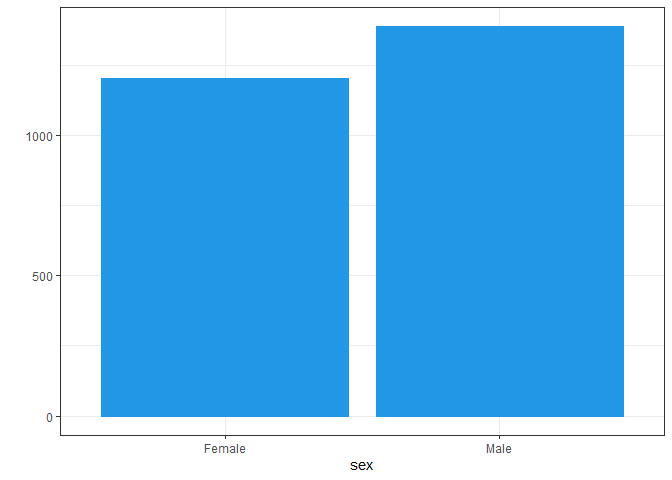

This small research is based on the joint WVS-EVS dataset:
<https://europeanvaluesstudy.eu/methodology-data-documentation/survey-2017/joint-evs-wvs/>

``` r
library(haven)
library(tidyverse)
library(sjmisc)
library(car)
library(yardstick)
library(pROC)
library(effects)
library(sjPlot)
library(rpart)
library(rpart.plot)
library(polycor)
library(psych)
library(GPArotation)

usa1 <- read.csv("USA.csv")                                                                                 
```

In modern political science discourse, electoral behavior is a popular
research object. Therefore, there are a lot of theoretical explanations,
which factors mainly influence this behavior. One of the most supported
theory, in my opinion, is based on the religiosity.

The relationship between religion and political participation has been
rigorously investigated, typically employing basic measures of church
attendance or denomination.It was done by many scientists, including R.
Driskell, E. Embry and L. Lyon. They state that collective aspects of
religious belief and practice often track with greater levels of
political participation (Driskell, R., Embry, E., & Lyon, L., 2008).
Moreover, it is found that effect of religious practices can differ
based on the specifics of a particular denomination. For example, L. E.
Smith and L. D. Walker state that observed effect is really weak for
Catholics (Smith, L. E., & Walker, L. D., 2013).

In this research I would like to check, how the level of religiosity,
including both participation and value dimension, affects participation
in local elections among US citizens. I find it extremely interesting
mainly because of multicultural composition of the country (in case of
religiosity), which, however, is dominated by protestant denomination. I
look forward to really interesting finding, how, first of all, value
dimension works in respect to local elections in the USA.

Therefore, my research question is following: **how religious belief and
practice is associated with electoral participation in the USA**?

For analysing electoral participation, I work with the variable from the
above mentioned data set, which contains respondents\` answers on the
question “When elections (local level) take place, do you vote always,
usually or never?”.

As predictors, I will use some socio-demographic variable as control
ones, and variable related to religiosity. Firstly, there will be some
indicators, which describe religious participation: - f028 - how often
respondent attend religious services (apart from weddings and
funerals); - f066_evs5 - how often respondent prays (apart from weddings
and funerals).

-   f034 - does respondent find him- or herself religious or not;
-   f063 - how God is important for respondent.

These are basic variables that are widely used in many researches
dedicated to this topic. However, I decide to include some additions
indicators, which represent belief dimension of religiosity: - f053 -
does respondent believe in hell or not; - f054 - does respondent believe
in heaven or not. I guess that these beliefs in something after life can
play controversial role in case of electoral participation: from one
hand, it can give additional impulses to participate in elections,
however, it can also avoid people from participation in everything that
is close to politics. There is a threat that I will find big
multicollinearity between these variables, but it worth to try to check
their effects.

Based on selected indicators, I hypothesize that: 1. High level of
religious participation is associated with the high level of electoral
participation at the local level. 2. Strong religious beliefs are also
associated with the high level of electoral participation at the local
level.

``` r
usa <- usa1 %>% filter(cntry_an == "US") %>%
  select(x001, x003, e263, f034, f028, f063, f066_evs5, f053, f054, f028b_wvs7) #choosing variables for US
```

Recoding elections variable:

First of all, this variable contains negative values that should be
recoded as NAs:

``` r
usa$elections <- ifelse(usa$e263 < 0, NA, usa$e263)
length(usa$elections) #153716
```

    ## [1] 2596

``` r
sum(is.na(usa$elections)) #5310
```

    ## [1] 33

For now, this variable contains only about 33 missing values. However, I
also want to recode as missings one category as a whole - people, who
are not allowed to vote. Based on them, it is impossible to somehow
evaluate the effect of religiosity.

``` r
usa %>% filter(elections == 4) %>% select(elections) %>% count()
```

    ##    n
    ## 1 88

There are only about 88 of respondents who will be also excluded from
the sample. It will not bring any bias in further analysis.

``` r
usa$elections1 <- ifelse(usa$elections == 4, NA, usa$elections)
sum(is.na(usa$elections1)) #121
```

    ## [1] 121

For now, the variable contains only about 121 missing values, which is a
really good result after all preprocessing steps.

``` r
descr(usa$elections1)
```

    ## 
    ## ## Basic descriptive statistics
    ## 
    ##  var    type label    n NA.prc mean   sd   se md trimmed   range iqr skew
    ##   dd integer    dd 2475   4.66 1.81 0.74 0.01  2    1.76 2 (1-3)   1 0.32

``` r
table(usa$elections1)
```

    ## 
    ##    1    2    3 
    ##  963 1027  485

The distribution of values in this variable is a bit right-skewed: the
minority of respondents belongs to the third category (they do not
participate in local elections). In order to balance the distribution, I
recode the variable into binary one. I divide respondents into two
groups: those who always participate in local elections, and those
participate not always or do not participate at all:

``` r
usa$loc_elect <- ifelse(usa$elections1 > 1, 0, 1)

table(usa$elections1, usa$loc_elect)
```

    ##    
    ##        0    1
    ##   1    0  963
    ##   2 1027    0
    ##   3  485    0

Variable was recoded correctly.

``` r
usa %>%
  ggplot(aes(loc_elect)) +
  geom_bar(fill = 4, colour = 4) +
  theme_bw() +
  ylab("") +
  scale_x_continuous(name = "\nElectoral Participation\n", breaks = c(0, 1),
                     labels = c("Non-participation", "Participation"))+
  theme(axis.text.x = element_text(face = "bold", size = 10))
```


Values are distributed not equally, but, in general, sample is not
extremely unbalanced.

As for other variables:

``` r
unique(usa$x001)
```

    ## [1] 2 1

``` r
names(usa)[names(usa) == "x001"] <- "sex" #gender variable
usa$sex <- ifelse(usa$sex == 2, "Female", "Male")
sum(is.na(usa$sex)) #0
```

    ## [1] 0

``` r
usa %>%
  ggplot(aes(sex)) +
  geom_bar(fill = 4, colour = 4) +
  theme_bw() +
  ylab("")
```



In case of gender, the sample is balanced enough.

``` r
unique(usa$x003)
```

    ##  [1] 25 73 43 71 54 74 69 27 28 66 68 58 20 44 47 55 18 37 26 59 52 24 23 31 67
    ## [26] 36 48 21 56 57 33 61 35 42 19 32 49 60 51 63 30 29 46 45 22 70 53 34 39 38
    ## [51] 72 64 40 78 50 65 82 62 79 80 81 75 41 76 77

``` r
names(usa)[names(usa) == "x003"] <- "age" #age variable
sum(is.na(usa$age)) #0
```

    ## [1] 0

``` r
usa %>%
  ggplot(aes(age)) +
  geom_histogram(bins = 15, fill = "white", colour = 4) +
labs(main = "",
         x = "\nAge\n") +
  theme_bw()
```


The distribution is a bit right-skewed, but it is okay for further
analysis.

``` r
names(usa)[names(usa) == "f034"] <- "relig" #is a respondent religious or not

unique(usa$relig) #it has missing values that are recoded as negative values
```

    ## [1]  1  2  3 -2

``` r
usa$relig <- ifelse(usa$relig < 0, NA, usa$relig) #negative values into NAs

usa$relig <- ifelse(usa$relig == 1, "Religious",
                       ifelse(usa$relig == 2, "Non-religious", "Atheist")) #labels instead of numbers

usa$relig <- as.factor(usa$relig) #as factor

sum(is.na(usa$relig)) #20, which is a small amount
```

    ## [1] 20

``` r
usa %>%
  ggplot(aes(relig)) +
  geom_bar(fill = 4, colour = 4) +
  theme_bw() +
  labs(main = "",
       y = "",
       x = "")
```


First of all, this variable contains not so many missing values. Also,
the distribution of this indicator is interesting: the majority of US
respondents identify themselves as atheists and non-religious. It will
be interesting to check, how the fact that respondent is religious
according to his or her opinion affects electoral participation.

As for the “Service attendance” variable:

``` r
names(usa)[names(usa) == "f028"] <- "services_attend" #how often respondent attends religious services

unique(usa$services_attend) #it has missing values that are recoded as negative values
```

    ## [1]  3  7  8  2  4  1  6 -2

``` r
usa$services_attend <- ifelse(usa$services_attend < 0, NA, usa$services_attend) #negative values into NAs
```

It is better to recode it as factor with labels instead of numbers,
because it contains not so many unique levels (8) and intervals between
them are not really equal to each other:

``` r
usa$attend_services <- as.factor(ifelse(usa$services_attend == 1, "More than once a week",
                                 ifelse(usa$services_attend == 2, "Once a week",
                                        ifelse(usa$services_attend == 3, "Once a month",
                                               ifelse(usa$services_attend == 4, "Christmas or Easter day",
                                                      ifelse(usa$services_attend == 5, "Other holy days",
                                                              ifelse(usa$services_attend == 6, "Once a year",
                                                                     ifelse(usa$services_attend == 7, "Less often than once a year", "Practically never"))))))))

table(usa$attend_services, usa$services_attend)
```

    ##                              
    ##                                 1   2   3   4   6   7   8
    ##   Christmas or Easter day       0   0   0 246   0   0   0
    ##   Less often than once a year   0   0   0   0   0 334   0
    ##   More than once a week       220   0   0   0   0   0   0
    ##   Once a month                  0   0 248   0   0   0   0
    ##   Once a week                   0 491   0   0   0   0   0
    ##   Once a year                   0   0   0   0 141   0   0
    ##   Practically never             0   0   0   0   0   0 906

Variable was recoded correctly.

``` r
as.data.frame(table(usa$attend_services))
```

    ##                          Var1 Freq
    ## 1     Christmas or Easter day  246
    ## 2 Less often than once a year  334
    ## 3       More than once a week  220
    ## 4                Once a month  248
    ## 5                 Once a week  491
    ## 6                 Once a year  141
    ## 7           Practically never  906

The majority of people attend such service practically never. However,
other categories still contain enough observation for further analysis.

``` r
names(usa)[names(usa) == "f063"] <- "god_imp" #the importance of God

unique(usa$god_imp) #it has missing values that are recoded as negative values
```

    ##  [1]  5  2  6  9 10  1  3  7  8  4 -2

``` r
usa$god_imp <- ifelse(usa$god_imp < 0, NA, usa$god_imp) #negative values into NAs

sum(is.na(usa$god_imp)) #18
```

    ## [1] 18

``` r
usa %>%
  ggplot(aes(god_imp)) +
  geom_histogram(bins = 6, fill = "white", colour = 4) +
  labs(main = "",
         x = "\nImportans of God\n") +
  theme_bw()
```


Distribution of “God importance” variable does not look like a
normal-one: the majority of values are in poles. However, it is not a
problem for further analysis.

``` r
names(usa)[names(usa) == "f028b_wvs7"] <- "pray" #how often respondent prays

unique(usa$pray) #it has missing values that are recoded as negative values
```

    ## [1]  3  1  8  2  7  5  6  4 -2

``` r
usa$pray <- ifelse(usa$pray < 0, NA, usa$pray) #negative values into NAs

sum(is.na(usa$pray)) #18
```

    ## [1] 18

With “pray” variable we have the same situation as with religious
services attendance. It is better to recode it as factor with labels
instead of numbers, because it contains not so many unique levels (8)
and intervals between them are not really equal to each other:

``` r
usa$pray_oft <- as.factor(ifelse(usa$pray == 1, "More than once a week",
                                 ifelse(usa$pray == 2, "Once a week",
                                        ifelse(usa$pray == 3, "Once a month",
                                               ifelse(usa$pray == 4, "Christmas or Easter day",
                                                      ifelse(usa$pray == 5, "Other holy days",
                                                              ifelse(usa$pray == 6, "Once a year",
                                                                     ifelse(usa$pray == 7, "Less often than once a year", "Practically never"))))))))

table(usa$pray_oft, usa$pray)
```

    ##                              
    ##                                 1   2   3   4   5   6   7   8
    ##   Christmas or Easter day       0   0   0 114   0   0   0   0
    ##   Less often than once a year   0   0   0   0   0   0 239   0
    ##   More than once a week       596   0   0   0   0   0   0   0
    ##   Once a month                  0   0 546   0   0   0   0   0
    ##   Once a week                   0 376   0   0   0   0   0   0
    ##   Once a year                   0   0   0   0   0  87   0   0
    ##   Other holy days               0   0   0   0  59   0   0   0
    ##   Practically never             0   0   0   0   0   0   0 561

Variable was recoded correctly.

``` r
as.data.frame(table(usa$pray_oft))
```

    ##                          Var1 Freq
    ## 1     Christmas or Easter day  114
    ## 2 Less often than once a year  239
    ## 3       More than once a week  596
    ## 4                Once a month  546
    ## 5                 Once a week  376
    ## 6                 Once a year   87
    ## 7             Other holy days   59
    ## 8           Practically never  561

Some categories here have not so many observations (like once a year,
other holy days). However, it is still enough for further analysis.

``` r
names(usa)[names(usa) == "f053"] <- "hell" #does respondent believe in hell or not

unique(usa$hell) #it has missing values that are recoded as negative values
```

    ## [1]  1 -2  0 -1

``` r
usa$hell <- ifelse(usa$hell < 0, NA, usa$hell) #negative values into NAs

usa$hell <- as.factor(ifelse(usa$hell == 0, "No", "Yes"))

usa$hell <- as.factor(usa$hell)

usa %>%
  ggplot(aes(hell)) +
  geom_bar(fill = 4, colour = 4) +
  theme_bw() +
  labs(main = "",
       y = "",
       x = "Believe in Hell")
```


This variable contains a small amount of missing values. Interesting
that the majority of respondents believe in hell according to their
answers. In general, the variable is balanced enough for further
analysis.

``` r
names(usa)[names(usa) == "f054"] <- "heaven" #does respondent believe in heaven or not

unique(usa$heaven) #it has missing values that are recoded as negative values
```

    ## [1]  1  0 -2 -1

``` r
usa$heaven <- ifelse(usa$heaven < 0, NA, usa$heaven) #negative values into NAs

usa$heaven <- as.factor(ifelse(usa$heaven == 0, "No", "Yes"))

usa$heaven <- as.factor(usa$heaven)

usa %>%
  ggplot(aes(heaven)) +
  geom_bar(fill = 4, colour = 4) +
  theme_bw() +
  labs(main ="",
       y = "",
       x = "\nBelieve in Heaven\n")
```


This variable contains a small amount of missing values. Again, the
majority of respondents believe in heaven according to their answers. In
general, the variable is balanced enough for further analysis.

As for missings in the final data set:

``` r
sum(is.na(usa)) #517
```

    ## [1] 499

``` r
nrow(usa)
```

    ## [1] 2596

``` r
f <- function(x) {
  sum(is.na(x))
}

lapply(usa, f)
```

    ## $sex
    ## [1] 0
    ## 
    ## $age
    ## [1] 0
    ## 
    ## $e263
    ## [1] 0
    ## 
    ## $relig
    ## [1] 20
    ## 
    ## $services_attend
    ## [1] 10
    ## 
    ## $god_imp
    ## [1] 18
    ## 
    ## $f066_evs5
    ## [1] 0
    ## 
    ## $hell
    ## [1] 73
    ## 
    ## $heaven
    ## [1] 57
    ## 
    ## $pray
    ## [1] 18
    ## 
    ## $elections
    ## [1] 33
    ## 
    ## $elections1
    ## [1] 121
    ## 
    ## $loc_elect
    ## [1] 121
    ## 
    ## $attend_services
    ## [1] 10
    ## 
    ## $pray_oft
    ## [1] 18

About 20 % of observations are missing values. It is relatively big
amoung, however, there are no variables which extremely big number of
them. Moreover, for me, it is important to keep all of them for further
analysis. Therefore, I will just exclude all NAs:

``` r
USA <- na.exclude(usa)

summary(USA)
```

    ##      sex                 age             e263                 relig     
    ##  Length:2384        Min.   :18.00   Min.   :1.000   Atheist      : 230  
    ##  Class :character   1st Qu.:30.00   1st Qu.:1.000   Non-religious: 828  
    ##  Mode  :character   Median :41.00   Median :2.000   Religious    :1326  
    ##                     Mean   :43.48   Mean   :1.806                       
    ##                     3rd Qu.:57.00   3rd Qu.:2.000                       
    ##                     Max.   :82.00   Max.   :3.000                       
    ##                                                                         
    ##  services_attend    god_imp         f066_evs5   hell      heaven    
    ##  Min.   :1.000   Min.   : 1.000   Min.   :-4   No : 815   No : 830  
    ##  1st Qu.:2.000   1st Qu.: 4.000   1st Qu.:-4   Yes:1569   Yes:1554  
    ##  Median :6.000   Median : 8.000   Median :-4                        
    ##  Mean   :5.135   Mean   : 6.731   Mean   :-4                        
    ##  3rd Qu.:8.000   3rd Qu.:10.000   3rd Qu.:-4                        
    ##  Max.   :8.000   Max.   :10.000   Max.   :-4                        
    ##                                                                     
    ##       pray         elections       elections1      loc_elect     
    ##  Min.   :1.000   Min.   :1.000   Min.   :1.000   Min.   :0.0000  
    ##  1st Qu.:2.000   1st Qu.:1.000   1st Qu.:1.000   1st Qu.:0.0000  
    ##  Median :3.000   Median :2.000   Median :2.000   Median :0.0000  
    ##  Mean   :4.003   Mean   :1.806   Mean   :1.806   Mean   :0.3893  
    ##  3rd Qu.:7.000   3rd Qu.:2.000   3rd Qu.:2.000   3rd Qu.:1.0000  
    ##  Max.   :8.000   Max.   :3.000   Max.   :3.000   Max.   :1.0000  
    ##                                                                  
    ##                     attend_services                        pray_oft  
    ##  Christmas or Easter day    :227    More than once a week      :561  
    ##  Less often than once a year:298    Practically never          :515  
    ##  More than once a week      :210    Once a month               :514  
    ##  Once a month               :231    Once a week                :350  
    ##  Once a week                :458    Less often than once a year:214  
    ##  Once a year                :126    Christmas or Easter day    :104  
    ##  Practically never          :834    (Other)                    :126

As a result, the sample contains 2384 observations. By excluding NAs I
lost about 200 of them, however, all variables that are selected are
crucial for the analysis. Therefore, having about 90 % of an original
sample at the end of all preprocessing steps is a good result.

Before regression analysis, I check relationships between dependent
variable (loc_elect) and predictors:

``` r
t.test(age ~ loc_elect, data = USA)
```

    ## 
    ##  Welch Two Sample t-test
    ## 
    ## data:  age by loc_elect
    ## t = -16.76, df = 1754, p-value < 2.2e-16
    ## alternative hypothesis: true difference in means between group 0 and group 1 is not equal to 0
    ## 95 percent confidence interval:
    ##  -12.393104  -9.796433
    ## sample estimates:
    ## mean in group 0 mean in group 1 
    ##        39.16277        50.25754

Here, with age, we can see that difference in means of two groups
(according to the loc_elect division) is significant: alternative
two-tailed hypothesis is accepted and p-value is less than 2.2e-16.

``` r
table(USA$loc_elect, USA$sex)
```

    ##    
    ##     Female Male
    ##   0    766  690
    ##   1    332  596

``` r
chisq.test(USA$loc_elect, USA$sex)
```

    ## 
    ##  Pearson's Chi-squared test with Yates' continuity correction
    ## 
    ## data:  USA$loc_elect and USA$sex
    ## X-squared = 63.971, df = 1, p-value = 1.263e-15

As for “sex” variable, here, according to the results of chi-square
tests, values are distributed not independently among levels of
variables (p-value = 1.263e-15, which is less than 0.05). Therefore,
they are not independent.

``` r
table(USA$loc_elect, USA$relig)
```

    ##    
    ##     Atheist Non-religious Religious
    ##   0     143           555       758
    ##   1      87           273       568

``` r
chisq.test(USA$loc_elect, USA$relig)
```

    ## 
    ##  Pearson's Chi-squared test
    ## 
    ## data:  USA$loc_elect and USA$relig
    ## X-squared = 20.993, df = 2, p-value = 2.763e-05

As for riligiosity variable, here, according to the results of
chi-square tests, values are distributed not independently among levels
of variables (p-value = 2.763e-05, which is less than 0.05). Therefore,
they are not independent.

``` r
table(USA$loc_elect, USA$attend_services)
```

    ##    
    ##     Christmas or Easter day Less often than once a year More than once a week
    ##   0                     144                         196                   108
    ##   1                      83                         102                   102
    ##    
    ##     Once a month Once a week Once a year Practically never
    ##   0          131         240          86               551
    ##   1          100         218          40               283

``` r
chisq.test(USA$loc_elect, USA$attend_services)
```

    ## 
    ##  Pearson's Chi-squared test
    ## 
    ## data:  USA$loc_elect and USA$attend_services
    ## X-squared = 39.335, df = 6, p-value = 6.153e-07

As for services attendance variable, here, according to the results of
chi-square tests, values are distributed not independently among levels
of variables (p-value = 6.153e-07, which is less than 0.05). Therefore,
they are not independent.

``` r
t.test(god_imp ~ loc_elect, data = USA)
```

    ## 
    ##  Welch Two Sample t-test
    ## 
    ## data:  god_imp by loc_elect
    ## t = -2.106, df = 1938.4, p-value = 0.03533
    ## alternative hypothesis: true difference in means between group 0 and group 1 is not equal to 0
    ## 95 percent confidence interval:
    ##  -0.59598582 -0.02122241
    ## sample estimates:
    ## mean in group 0 mean in group 1 
    ##        6.610577        6.919181

Here, with importance of God, we can see that difference in means of two
groups (according to the loc_elect division) is significant: alternative
two-tailed hypothesis is accepted and p-value is less than 2.2e-16.

``` r
table(USA$loc_elect, USA$hell)
```

    ##    
    ##      No Yes
    ##   0 488 968
    ##   1 327 601

``` r
chisq.test(USA$loc_elect, USA$hell)
```

    ## 
    ##  Pearson's Chi-squared test with Yates' continuity correction
    ## 
    ## data:  USA$loc_elect and USA$hell
    ## X-squared = 0.67123, df = 1, p-value = 0.4126

As for beliefs in hell, it can be concluded that these variables do not
depend on each other: p-value = 0.4126, which is higher than 0.05.

``` r
table(USA$loc_elect, USA$heaven)
```

    ##    
    ##      No Yes
    ##   0 518 938
    ##   1 312 616

``` r
chisq.test(USA$loc_elect, USA$heaven)
```

    ## 
    ##  Pearson's Chi-squared test with Yates' continuity correction
    ## 
    ## data:  USA$loc_elect and USA$heaven
    ## X-squared = 0.87146, df = 1, p-value = 0.3506

As for beliefs in heaven, it can be concluded that these variables do
not depend on each other: p-value = 0.3506, which is higher than 0.05.

``` r
table(USA$loc_elect, USA$pray_oft)
```

    ##    
    ##     Christmas or Easter day Less often than once a year More than once a week
    ##   0                      63                         153                   305
    ##   1                      41                          61                   256
    ##    
    ##     Once a month Once a week Once a year Other holy days Practically never
    ##   0          336         202          51              29               317
    ##   1          178         148          24              22               198

``` r
chisq.test(USA$loc_elect, USA$pray_oft)
```

    ## 
    ##  Pearson's Chi-squared test
    ## 
    ## data:  USA$loc_elect and USA$pray_oft
    ## X-squared = 27.996, df = 7, p-value = 0.0002202

As for “pray often” variable, here, according to the results of
chi-square tests, values are distributed not independently among levels
of variables (p-value = 0.0002202, which is less than 0.05). Therefore,
they are not independent.

As a conclusion, all selected variables except “hell” and “heaven” will
be used as predictors in further analysis.

For building a logit regression model, I use forward selection. The
first model contains only control variables:

``` r
model1 <- glm(loc_elect ~ age + sex, data = USA, family = "binomial")

summary(model1)
```

    ## 
    ## Call:
    ## glm(formula = loc_elect ~ age + sex, family = "binomial", data = USA)
    ## 
    ## Deviance Residuals: 
    ##     Min       1Q   Median       3Q      Max  
    ## -1.7662  -0.9251  -0.6803   1.0669   1.9808  
    ## 
    ## Coefficients:
    ##              Estimate Std. Error z value Pr(>|z|)    
    ## (Intercept) -2.570836   0.141189 -18.209  < 2e-16 ***
    ## age          0.042251   0.002917  14.486  < 2e-16 ***
    ## sexMale      0.430017   0.091847   4.682 2.84e-06 ***
    ## ---
    ## Signif. codes:  0 '***' 0.001 '**' 0.01 '*' 0.05 '.' 0.1 ' ' 1
    ## 
    ## (Dispersion parameter for binomial family taken to be 1)
    ## 
    ##     Null deviance: 3187.0  on 2383  degrees of freedom
    ## Residual deviance: 2892.1  on 2381  degrees of freedom
    ## AIC: 2898.1
    ## 
    ## Number of Fisher Scoring iterations: 4

``` r
exp(model1$coefficients)
```

    ## (Intercept)         age     sexMale 
    ##  0.07647158  1.04315671  1.53728371

First of all, all control predictors have significant effect on the
dependent variable (p-values of both predictors less then 0.05). As for
the effect itself, we can more precisely observe it by exponentiating
log odds that we have in the original output of logit regression: -
**1.04315671** for age means that with the increase of age on 1 point
(in case of age is it 1 year) the odds of taking part in local elections
would be 1.04315671 times higher (or + 4 %); - **1.53728371** for sex
means that if person is male, he 1.53728371times higher odds to
participate in local elections in comparison to female (or + 50 %). It
is really interesting, because I additionally run models for a couple of
other countries (just because f curiosity), and in ALL of them sex
predictor had insignificant effect. In the US, as we can see, it works.

The next model also includes indicator, which represents how often
respondents attend religious services:

``` r
USA$attend_services <- relevel(USA$attend_services, ref = "Practically never")

model2 <- glm(loc_elect ~ age + sex + attend_services, data = USA, family = "binomial")

summary(model2)
```

    ## 
    ## Call:
    ## glm(formula = loc_elect ~ age + sex + attend_services, family = "binomial", 
    ##     data = USA)
    ## 
    ## Deviance Residuals: 
    ##     Min       1Q   Median       3Q      Max  
    ## -1.8671  -0.9187  -0.6634   1.0746   2.1064  
    ## 
    ## Coefficients:
    ##                                             Estimate Std. Error z value
    ## (Intercept)                                -2.763954   0.157165 -17.586
    ## age                                         0.041275   0.002956  13.962
    ## sexMale                                     0.468570   0.092881   5.045
    ## attend_servicesChristmas or Easter day      0.293343   0.165738   1.770
    ## attend_servicesLess often than once a year  0.033315   0.150341   0.222
    ## attend_servicesMore than once a week        0.496237   0.168081   2.952
    ## attend_servicesOnce a month                 0.519552   0.161587   3.215
    ## attend_servicesOnce a week                  0.461502   0.127485   3.620
    ## attend_servicesOnce a year                 -0.082360   0.217033  -0.379
    ##                                            Pr(>|z|)    
    ## (Intercept)                                 < 2e-16 ***
    ## age                                         < 2e-16 ***
    ## sexMale                                    4.54e-07 ***
    ## attend_servicesChristmas or Easter day     0.076741 .  
    ## attend_servicesLess often than once a year 0.824627    
    ## attend_servicesMore than once a week       0.003153 ** 
    ## attend_servicesOnce a month                0.001303 ** 
    ## attend_servicesOnce a week                 0.000295 ***
    ## attend_servicesOnce a year                 0.704329    
    ## ---
    ## Signif. codes:  0 '***' 0.001 '**' 0.01 '*' 0.05 '.' 0.1 ' ' 1
    ## 
    ## (Dispersion parameter for binomial family taken to be 1)
    ## 
    ##     Null deviance: 3187.0  on 2383  degrees of freedom
    ## Residual deviance: 2865.8  on 2375  degrees of freedom
    ## AIC: 2883.8
    ## 
    ## Number of Fisher Scoring iterations: 4

``` r
exp(model2$coefficients)
```

    ##                                (Intercept) 
    ##                                 0.06304201 
    ##                                        age 
    ##                                 1.04213854 
    ##                                    sexMale 
    ##                                 1.59770822 
    ##     attend_servicesChristmas or Easter day 
    ##                                 1.34090199 
    ## attend_servicesLess often than once a year 
    ##                                 1.03387651 
    ##       attend_servicesMore than once a week 
    ##                                 1.64252939 
    ##                attend_servicesOnce a month 
    ##                                 1.68127441 
    ##                 attend_servicesOnce a week 
    ##                                 1.58645488 
    ##                 attend_servicesOnce a year 
    ##                                 0.92094023

First of all, all levels of some levels of service attendance variables
have significant effect on the participation in local elections in the
USA. Taking into account that reference category here are respondents
who attend such services practically never (I change reference, because,
in my opinion, it is more interesting to compare all effects with this
category), we can make following conclusion: - people, who attend such
services once a month, once a week or more than once a week, have higher
odds to participate in local US elections, in comparison with people who
practically never attend services (+68 %, + 58 % and + 64 %
respectively).

The next model also includes indicator, which represents how God is
important for the respondents:

``` r
model3 <- glm(loc_elect ~ age + sex + attend_services + god_imp, data = USA, family = "binomial")

summary(model3)
```

    ## 
    ## Call:
    ## glm(formula = loc_elect ~ age + sex + attend_services + god_imp, 
    ##     family = "binomial", data = USA)
    ## 
    ## Deviance Residuals: 
    ##     Min       1Q   Median       3Q      Max  
    ## -1.8728  -0.9176  -0.6611   1.0736   2.1306  
    ## 
    ## Coefficients:
    ##                                             Estimate Std. Error z value
    ## (Intercept)                                -2.573574   0.164183 -15.675
    ## age                                         0.043807   0.003067  14.284
    ## sexMale                                     0.407479   0.094526   4.311
    ## attend_servicesChristmas or Easter day      0.469033   0.172999   2.711
    ## attend_servicesLess often than once a year  0.225822   0.159777   1.413
    ## attend_servicesMore than once a week        0.838471   0.193268   4.338
    ## attend_servicesOnce a month                 0.742349   0.173302   4.284
    ## attend_servicesOnce a week                  0.771205   0.153851   5.013
    ## attend_servicesOnce a year                  0.017476   0.220189   0.079
    ## god_imp                                    -0.063373   0.017215  -3.681
    ##                                            Pr(>|z|)    
    ## (Intercept)                                 < 2e-16 ***
    ## age                                         < 2e-16 ***
    ## sexMale                                    1.63e-05 ***
    ## attend_servicesChristmas or Easter day     0.006704 ** 
    ## attend_servicesLess often than once a year 0.157551    
    ## attend_servicesMore than once a week       1.44e-05 ***
    ## attend_servicesOnce a month                1.84e-05 ***
    ## attend_servicesOnce a week                 5.37e-07 ***
    ## attend_servicesOnce a year                 0.936739    
    ## god_imp                                    0.000232 ***
    ## ---
    ## Signif. codes:  0 '***' 0.001 '**' 0.01 '*' 0.05 '.' 0.1 ' ' 1
    ## 
    ## (Dispersion parameter for binomial family taken to be 1)
    ## 
    ##     Null deviance: 3187.0  on 2383  degrees of freedom
    ## Residual deviance: 2852.1  on 2374  degrees of freedom
    ## AIC: 2872.1
    ## 
    ## Number of Fisher Scoring iterations: 4

``` r
exp(model3$coefficients)
```

    ##                                (Intercept) 
    ##                                 0.07626252 
    ##                                        age 
    ##                                 1.04478061 
    ##                                    sexMale 
    ##                                 1.50302450 
    ##     attend_servicesChristmas or Easter day 
    ##                                 1.59844852 
    ## attend_servicesLess often than once a year 
    ##                                 1.25335298 
    ##       attend_servicesMore than once a week 
    ##                                 2.31282723 
    ##                attend_servicesOnce a month 
    ##                                 2.10086480 
    ##                 attend_servicesOnce a week 
    ##                                 2.16236989 
    ##                 attend_servicesOnce a year 
    ##                                 1.01762986 
    ##                                    god_imp 
    ##                                 0.93859305

First of all, all predictors have significant effect on the dependent
variable (p-values of all predictors less then 0.05). Also, we can note
a difference in odds for attend_services: for now, for people, who
attend such services once a month it is + 110 %, once a week - +116 %,
more than once a week - +231 %, in comparison with people who
practically never attend services. Also, now this effect is significant
for people that attend services only on Christmas or Easter day: + 60 %
odds, compare to respondents from the reference group.

As for the importance of God, this indicator has negative effect on odds
in case of local election participation: with the increase of the
importance of God, the odds to take part would decrease on about 6 % for
each point.

The next model also includes indicator, which represents how respondents
identify themselves in case of religiosity:

``` r
model4 <- glm(loc_elect ~ age + sex + attend_services + god_imp + relig, data = USA, family = "binomial")

summary(model4)
```

    ## 
    ## Call:
    ## glm(formula = loc_elect ~ age + sex + attend_services + god_imp + 
    ##     relig, family = "binomial", data = USA)
    ## 
    ## Deviance Residuals: 
    ##     Min       1Q   Median       3Q      Max  
    ## -1.8780  -0.9208  -0.6599   1.0729   2.1106  
    ## 
    ## Coefficients:
    ##                                             Estimate Std. Error z value
    ## (Intercept)                                -2.454514   0.195040 -12.585
    ## age                                         0.043450   0.003074  14.135
    ## sexMale                                     0.410659   0.094628   4.340
    ## attend_servicesChristmas or Easter day      0.438243   0.176268   2.486
    ## attend_servicesLess often than once a year  0.208409   0.162006   1.286
    ## attend_servicesMore than once a week        0.778217   0.196394   3.963
    ## attend_servicesOnce a month                 0.700046   0.176952   3.956
    ## attend_servicesOnce a week                  0.721274   0.157071   4.592
    ## attend_servicesOnce a year                  0.006178   0.221520   0.028
    ## god_imp                                    -0.075916   0.021074  -3.602
    ## religNon-religious                         -0.143385   0.179335  -0.800
    ## religReligious                              0.094228   0.216685   0.435
    ##                                            Pr(>|z|)    
    ## (Intercept)                                 < 2e-16 ***
    ## age                                         < 2e-16 ***
    ## sexMale                                    1.43e-05 ***
    ## attend_servicesChristmas or Easter day     0.012910 *  
    ## attend_servicesLess often than once a year 0.198293    
    ## attend_servicesMore than once a week       7.42e-05 ***
    ## attend_servicesOnce a month                7.62e-05 ***
    ## attend_servicesOnce a week                 4.39e-06 ***
    ## attend_servicesOnce a year                 0.977751    
    ## god_imp                                    0.000315 ***
    ## religNon-religious                         0.423978    
    ## religReligious                             0.663663    
    ## ---
    ## Signif. codes:  0 '***' 0.001 '**' 0.01 '*' 0.05 '.' 0.1 ' ' 1
    ## 
    ## (Dispersion parameter for binomial family taken to be 1)
    ## 
    ##     Null deviance: 3187.0  on 2383  degrees of freedom
    ## Residual deviance: 2848.1  on 2372  degrees of freedom
    ## AIC: 2872.1
    ## 
    ## Number of Fisher Scoring iterations: 4

``` r
exp(model4$coefficients)
```

    ##                                (Intercept) 
    ##                                 0.08590491 
    ##                                        age 
    ##                                 1.04440789 
    ##                                    sexMale 
    ##                                 1.50781106 
    ##     attend_servicesChristmas or Easter day 
    ##                                 1.54998125 
    ## attend_servicesLess often than once a year 
    ##                                 1.23171721 
    ##       attend_servicesMore than once a week 
    ##                                 2.17758667 
    ##                attend_servicesOnce a month 
    ##                                 2.01384591 
    ##                 attend_servicesOnce a week 
    ##                                 2.05705223 
    ##                 attend_servicesOnce a year 
    ##                                 1.00619689 
    ##                                    god_imp 
    ##                                 0.92689425 
    ##                         religNon-religious 
    ##                                 0.86642007 
    ##                             religReligious 
    ##                                 1.09881042

Religiosity indicator is insignificant here: all levels of this
variables have relatively similar effect on electoral participation at
the local level (with some “liberal” pre-assumptions about alpha-level,
non-religious respondents would show a difference in participation,
compare to the atheists; however, it is not a case here). Therefore,
this indicator will be removed from the model. Moreover, it is
meaningless to interpret odds results here.

In the next model is included indicator, which represents how often
respondents pray:

``` r
model5 <- glm(loc_elect ~ age + sex + attend_services + god_imp + pray_oft, data = USA, family = "binomial")

summary(model5)
```

    ## 
    ## Call:
    ## glm(formula = loc_elect ~ age + sex + attend_services + god_imp + 
    ##     pray_oft, family = "binomial", data = USA)
    ## 
    ## Deviance Residuals: 
    ##     Min       1Q   Median       3Q      Max  
    ## -1.8848  -0.9188  -0.6628   1.0753   2.2126  
    ## 
    ## Coefficients:
    ##                                             Estimate Std. Error z value
    ## (Intercept)                                -2.662549   0.307924  -8.647
    ## age                                         0.043413   0.003088  14.058
    ## sexMale                                     0.408912   0.095705   4.273
    ## attend_servicesChristmas or Easter day      0.462333   0.186501   2.479
    ## attend_servicesLess often than once a year  0.262820   0.164911   1.594
    ## attend_servicesMore than once a week        0.791017   0.207027   3.821
    ## attend_servicesOnce a month                 0.745469   0.184414   4.042
    ## attend_servicesOnce a week                  0.750171   0.164575   4.558
    ## attend_servicesOnce a year                  0.026353   0.226826   0.116
    ## god_imp                                    -0.058432   0.023413  -2.496
    ## pray_oftLess often than once a year        -0.152389   0.282597  -0.539
    ## pray_oftMore than once a week               0.118767   0.253033   0.469
    ## pray_oftOnce a month                        0.009456   0.242763   0.039
    ## pray_oftOnce a week                         0.096347   0.254719   0.378
    ## pray_oftOnce a year                         0.134229   0.347133   0.387
    ## pray_oftOther holy days                     0.340251   0.377543   0.901
    ## pray_oftPractically never                   0.149373   0.274282   0.545
    ##                                            Pr(>|z|)    
    ## (Intercept)                                 < 2e-16 ***
    ## age                                         < 2e-16 ***
    ## sexMale                                    1.93e-05 ***
    ## attend_servicesChristmas or Easter day     0.013175 *  
    ## attend_servicesLess often than once a year 0.111002    
    ## attend_servicesMore than once a week       0.000133 ***
    ## attend_servicesOnce a month                5.29e-05 ***
    ## attend_servicesOnce a week                 5.16e-06 ***
    ## attend_servicesOnce a year                 0.907508    
    ## god_imp                                    0.012570 *  
    ## pray_oftLess often than once a year        0.589719    
    ## pray_oftMore than once a week              0.638803    
    ## pray_oftOnce a month                       0.968929    
    ## pray_oftOnce a week                        0.705246    
    ## pray_oftOnce a year                        0.698993    
    ## pray_oftOther holy days                    0.367469    
    ## pray_oftPractically never                  0.586032    
    ## ---
    ## Signif. codes:  0 '***' 0.001 '**' 0.01 '*' 0.05 '.' 0.1 ' ' 1
    ## 
    ## (Dispersion parameter for binomial family taken to be 1)
    ## 
    ##     Null deviance: 3187.0  on 2383  degrees of freedom
    ## Residual deviance: 2848.1  on 2367  degrees of freedom
    ## AIC: 2882.1
    ## 
    ## Number of Fisher Scoring iterations: 4

``` r
exp(model5$coefficients)
```

    ##                                (Intercept) 
    ##                                 0.06977012 
    ##                                        age 
    ##                                 1.04436880 
    ##                                    sexMale 
    ##                                 1.50517969 
    ##     attend_servicesChristmas or Easter day 
    ##                                 1.58777424 
    ## attend_servicesLess often than once a year 
    ##                                 1.30059265 
    ##       attend_servicesMore than once a week 
    ##                                 2.20563826 
    ##                attend_servicesOnce a month 
    ##                                 2.10742868 
    ##                 attend_servicesOnce a week 
    ##                                 2.11736223 
    ##                 attend_servicesOnce a year 
    ##                                 1.02670342 
    ##                                    god_imp 
    ##                                 0.94324241 
    ##        pray_oftLess often than once a year 
    ##                                 0.85865449 
    ##              pray_oftMore than once a week 
    ##                                 1.12610751 
    ##                       pray_oftOnce a month 
    ##                                 1.00950072 
    ##                        pray_oftOnce a week 
    ##                                 1.10114105 
    ##                        pray_oftOnce a year 
    ##                                 1.14365481 
    ##                    pray_oftOther holy days 
    ##                                 1.40530034 
    ##                  pray_oftPractically never 
    ##                                 1.16110557

“Pray” indicator is insignificant here: p-value of all levels of this
variable effect are bigger than 0.05. Therefore, this indicator will be
removed from the model. Moreover, it is meaningless to interpret odds
results here.

As a interim conclusion, model 3 is a final one. It includes only two
predictors: religious services attendance (with positive effect) and
importance of God (with negative effect). In general, it can be assumed
that services attendance represents a group participation dimension, and
God importance is about value side of observed effect. However,
interesting that value dimension has negative effect on electoral
participation.

As for the hypotheses, one of them is disproved by results: 1. High
level of religious participation **is associated** with the high level
of electoral participation at the local level. 2. Strong religious
beliefs **are not associated** with the high level of electoral
participation at the local level.

In order to make sure that we can conclude something about results, it
is necessary to check the model fit. I will do with the use of confusion
matrix. It represents how many of cases were predicted correctly. For
doing so, I will use yardstick package, which allows us to create a
detailed report on how model is fitted. But first of all, I need to
create a regular table, in which includes actual value from dataset and
predicted by model 3 values:

``` r
actual_response <- USA$loc_elect

predicted_response <- round(fitted(model3))

(outcomes <- table(predicted_response, actual_response))
```

    ##                   actual_response
    ## predicted_response    0    1
    ##                  0 1227  498
    ##                  1  229  430

According to this table, there are 229 false positive and 498 false
negative values, which are mistakes of the model.

``` r
confusion_matrix <- conf_mat(outcomes)

(conf_indicators <- summary(confusion_matrix, event_level = "second"))
```

    ## # A tibble: 13 × 3
    ##    .metric              .estimator .estimate
    ##    <chr>                <chr>          <dbl>
    ##  1 accuracy             binary         0.695
    ##  2 kap                  binary         0.323
    ##  3 sens                 binary         0.463
    ##  4 spec                 binary         0.843
    ##  5 ppv                  binary         0.653
    ##  6 npv                  binary         0.711
    ##  7 mcc                  binary         0.334
    ##  8 j_index              binary         0.306
    ##  9 bal_accuracy         binary         0.653
    ## 10 detection_prevalence binary         0.276
    ## 11 precision            binary         0.653
    ## 12 recall               binary         0.463
    ## 13 f_meas               binary         0.542

``` r
autoplot(confusion_matrix, type = "mosaic")
```


Plot represents the same information that is presented above. Here it is
clear that number of mistakes is much less than, for example, number of
True Negative values, which are predicted correctly and represented by
the left upper corner of the plot. However, it is still necessary to
check some main cafeterias, such as **accuracy** - how often is the
classifier correct ((TP+TN)/total), **sensitivity** - how apt the model
is to detecting events in the positive class (TP/ TP + FN),
**specificity** - true negative rate (TN / TN + FP):

``` r
conf_indicators %>% filter(.metric %in% list("accuracy", "spec", "sens"))
```

    ## # A tibble: 3 × 3
    ##   .metric  .estimator .estimate
    ##   <chr>    <chr>          <dbl>
    ## 1 accuracy binary         0.695
    ## 2 sens     binary         0.463
    ## 3 spec     binary         0.843

In general, model is enough well fitted - accuracy = 0.6950503, which
means that model predicts correctly in about 70 % of cases. Also, we
have high specificity - model is okay in prediction of true negative
values, what we have already concluded based on the plot. However, there
is a problem with detecting true positive values: their share
(sensitivity) in relatively small. This results of model fitting can be
due to the sample: it was a bit unbalanced with the majority of
respondents, who do not participate in local elections.

In general, model has rights to exist with such parameters. But it is
also important to check another parameter - area under the curve
(receiver operating characteristic, which is a graph showing the
performance of the arrest model across all penalty thresholds) or
**auc**:

``` r
for_auc = roc(USA$loc_elect, fitted(model3)) 
plot(for_auc, col="red")
```


``` r
auc(for_auc)
```

    ## Area under the curve: 0.7108

As we can see, auc = 0.7108. It means that model predicts about 71 % of
cases correctly. This is not a big percent, however, this model still
have rights to exist.

Because model is fitted relatively goog, we can check marginal effects
without any changes in it:

``` r
m.eff<-allEffects(model3)
m.eff
```

    ##  model: loc_elect ~ age + sex + attend_services + god_imp
    ## 
    ##  age effect
    ## age
    ##        20        30        50        70        80 
    ## 0.1770570 0.2500499 0.4446755 0.6578957 0.7487581 
    ## 
    ##  sex effect
    ## sex
    ##    Female      Male 
    ## 0.3257287 0.4206543 
    ## 
    ##  attend_services effect
    ## attend_services
    ##           Practically never     Christmas or Easter day 
    ##                   0.2941067                   0.3997545 
    ## Less often than once a year       More than once a week 
    ##                   0.3430573                   0.4907383 
    ##                Once a month                 Once a week 
    ##                   0.4667560                   0.4739444 
    ##                 Once a year 
    ##                   0.2977479 
    ## 
    ##  god_imp effect
    ## god_imp
    ##         1         3         6         8        10 
    ## 0.4639159 0.4325796 0.3866409 0.3570478 0.3285066

Here we have predicted probabilities to participate in local elections
and their changes due to changes in predictors.

For example, if a person is 20 years old, he or she has just about 18 %
probability to participate in local US elections. However, with the
increase in age we observe the increase in probabilities too: if a
person is 50 years old - about 44 % probability to participate, if 80 -
even about 75 %. Therefore, age has a strong positive effect of
electoral behavior at local level in the USA.

In case of gender we also observe significant difference: if a person is
female, she has about 33 % probability to elect at local level. However,
if person is male, he has about 42 % probability. This is much higher,
but still not really big. Probably, in the US local elections are not
popular, which can explain that the majority of respondents in the
sample do not participate in them.

As for the religious services attendance, some of the levels of this
indicator also have positive effects. For example, (taking into account
that effects of such levels as “once a year” and “less than once a year”
are insignificant) if a person practically never attends religious
services, he or she would have only about 30 % probability to
participate in local US elections. Also, if a person attends religious
services only on Christmas or Easter day, he or she would have about 40
% probability to participate in local US elections. People, who attend
such services once a month, once a week or more than once a week, have
higher odds to participate in local US election (47 %, 47 % and 49 %
respectively).

With “importance of God” variable we observe completely different
effect. If God is not important for a person, he or she has about 46 %
probability to participate in local US elections. In contrast, if God is
very important, a person has about 33 % probability.

The same information is represented by the plots:

``` r
plot_model(model3, type="pred")
```

    ## $age


    ## 
    ## $sex


    ## 
    ## $attend_services


    ## 
    ## $god_imp


Also, it is interesting to check interaction effect between some
variables. I hypothesize that we an observe significant effect between
gender and age because of their strong influence in previous models:

``` r
int_eff <- glm(loc_elect ~ age * sex + attend_services + god_imp, data = USA, family = "binomial")

summary(int_eff)
```

    ## 
    ## Call:
    ## glm(formula = loc_elect ~ age * sex + attend_services + god_imp, 
    ##     family = "binomial", data = USA)
    ## 
    ## Deviance Residuals: 
    ##     Min       1Q   Median       3Q      Max  
    ## -1.9812  -0.8973  -0.6778   1.0708   2.0527  
    ## 
    ## Coefficients:
    ##                                             Estimate Std. Error z value
    ## (Intercept)                                -2.184433   0.213185 -10.247
    ## age                                         0.034159   0.004603   7.421
    ## sexMale                                    -0.319583   0.280496  -1.139
    ## attend_servicesChristmas or Easter day      0.463377   0.173446   2.672
    ## attend_servicesLess often than once a year  0.237915   0.160092   1.486
    ## attend_servicesMore than once a week        0.831220   0.193732   4.291
    ## attend_servicesOnce a month                 0.737048   0.173345   4.252
    ## attend_servicesOnce a week                  0.772318   0.154167   5.010
    ## attend_servicesOnce a year                  0.008829   0.221128   0.040
    ## god_imp                                    -0.061256   0.017274  -3.546
    ## age:sexMale                                 0.016515   0.006002   2.752
    ##                                            Pr(>|z|)    
    ## (Intercept)                                 < 2e-16 ***
    ## age                                        1.16e-13 ***
    ## sexMale                                    0.254557    
    ## attend_servicesChristmas or Easter day     0.007549 ** 
    ## attend_servicesLess often than once a year 0.137248    
    ## attend_servicesMore than once a week       1.78e-05 ***
    ## attend_servicesOnce a month                2.12e-05 ***
    ## attend_servicesOnce a week                 5.45e-07 ***
    ## attend_servicesOnce a year                 0.968152    
    ## god_imp                                    0.000391 ***
    ## age:sexMale                                0.005930 ** 
    ## ---
    ## Signif. codes:  0 '***' 0.001 '**' 0.01 '*' 0.05 '.' 0.1 ' ' 1
    ## 
    ## (Dispersion parameter for binomial family taken to be 1)
    ## 
    ##     Null deviance: 3187.0  on 2383  degrees of freedom
    ## Residual deviance: 2844.5  on 2373  degrees of freedom
    ## AIC: 2866.5
    ## 
    ## Number of Fisher Scoring iterations: 4

``` r
exp(int_eff$coefficients)
```

    ##                                (Intercept) 
    ##                                  0.1125415 
    ##                                        age 
    ##                                  1.0347495 
    ##                                    sexMale 
    ##                                  0.7264516 
    ##     attend_servicesChristmas or Easter day 
    ##                                  1.5894327 
    ## attend_servicesLess often than once a year 
    ##                                  1.2686015 
    ##       attend_servicesMore than once a week 
    ##                                  2.2961188 
    ##                attend_servicesOnce a month 
    ##                                  2.0897573 
    ##                 attend_servicesOnce a week 
    ##                                  2.1647781 
    ##                 attend_servicesOnce a year 
    ##                                  1.0088680 
    ##                                    god_imp 
    ##                                  0.9405828 
    ##                                age:sexMale 
    ##                                  1.0166526

Of course, this effect is significant. Age effect is stronger fore
males: the increase in age for males leads to about 2 % increase in odds
to participate in elections. Also, important to note that sex variable
itself becomes insignificant. It is obvious, because this indicator and
created interaction shows relatively same things, which is proved by
high multicollinearity shown by the variance inflation factor (9.446207
for sex and 11.983007 for interaction).

``` r
plot_model(int_eff, type = "pred", terms = c("age", "sex")) +
  labs(x = "\nAge\n",
           y = "\nProbability to participate in elections\n") +
  theme_bw()
```


In general, age has positive effect on both genders. However, in case of
males it is much stronger and no so linear.

Another method of classification that can be applied here is decision
tree. I will create a classification and regression tree (CART), because
I am interested not only in estimating numeric values, but also in some
classification (in case of sex variable):

``` r
tree <- rpart(loc_elect ~ age + sex + attend_services + god_imp, data=USA, control=rpart.control(cp=.0001))
prp(tree)
```


For sure, this tree is overfitted. I will prune it, based on the best
complexity parameter:

``` r
best <- tree$cptable[which.min(tree$cptable[,"xerror"]),"CP"]

pruned_tree <- prune(tree, cp=best)

prp(pruned_tree)
```


As a result, we observed that, in general, this classification is based
on the all of 4 indicators, presented in the logit regression model:
age, gender, religious services attendance and importance of God. The
overall logic of classification is the same: higher the age (this
variable is a root here) - higher the probability to participate in
local US elections; for males the probability to participate is higher,
in comparison with females; more frequent the attendance of services -
higher the probability to participate. higher the importance of God -
less the probability to participate in local US elections. However,
there is on branch, where the importance of God positively affects
electoral participation: for males aged 57 or higher (if importance is
not less than 8, prababily is higher, compare to the case if importance
is less). As I can see, it is the main difference, compare to the logit
regression model: there God importance has only negative effect; if a
person attends religious services more frequently, the probability to
participate in local US elections is much higher. The highest
probability to participate have males aged 65 or higher, who frequently
attend religious services.

Another important factor that influence electoral participation at all
level, including a local one, in person\`s confidence in institutions,
which somehow influence the political sphere. However, confidence is a
really complicated and latent factor. Even in case of institutions,
confidence in different organisations can represent different dimensions
of this factor. In such situations, it is necessary to implement
**exploratory factor analysis** (EFA) in order to check, which factors
are hidden behind variables, which are, from the first look, can be
responsible for a single latent factor.

``` r
efa_data <- usa1 %>%
  select(e069_01, e069_02, e069_04, e069_05, e069_06, e069_07, e069_08, e069_18a, e069_18,
         e069_11, e069_12, e069_13, e069_14, e069_17, e069_20)
```

As it mentioned above, here I analyse confidence and institutions, such
as: church, army, press, labour union, police, national parliament,
civil services, regional organisations, the EU, national government,
political parties, major companies (commercial), environment protection
agencies, court and the UN.

``` r
names(efa_data) <- c("church", "army", "press", "labour_un", "police", "parliament",
                     "civil_serv", "region_org", "EU", "government", "parties",
                     "companies", "environment_pr", "court", "UN")

names(efa_data)
```

    ##  [1] "church"         "army"           "press"          "labour_un"     
    ##  [5] "police"         "parliament"     "civil_serv"     "region_org"    
    ##  [9] "EU"             "government"     "parties"        "companies"     
    ## [13] "environment_pr" "court"          "UN"

``` r
descr(efa_data)
```

    ## 
    ## ## Basic descriptive statistics
    ## 
    ##             var    type          label    n NA.prc  mean   sd   se md trimmed
    ##          church integer         church 2596      0  2.44 0.95 0.02  2    2.46
    ##            army integer           army 2596      0  1.90 0.85 0.02  2    1.86
    ##           press integer          press 2596      0  2.85 0.92 0.02  3    2.91
    ##       labour_un integer      labour_un 2596      0  2.69 0.98 0.02  3    2.76
    ##          police integer         police 2596      0  2.16 0.88 0.02  2    2.15
    ##      parliament integer     parliament 2596      0  3.04 0.83 0.02  3    3.12
    ##      civil_serv integer     civil_serv 2596      0  2.56 0.93 0.02  3    2.59
    ##      region_org integer     region_org 2596      0  2.61 1.01 0.02  3    2.68
    ##              EU integer             EU 2596      0 -4.00 0.00 0.00 -4   -4.00
    ##      government integer     government 2596      0  2.89 0.99 0.02  3    2.99
    ##         parties integer        parties 2596      0  3.10 0.79 0.02  3    3.19
    ##       companies integer      companies 2596      0  2.75 0.85 0.02  3    2.78
    ##  environment_pr integer environment_pr 2596      0  2.38 0.95 0.02  2    2.40
    ##           court integer          court 2596      0  2.34 0.89 0.02  2    2.38
    ##              UN integer             UN 2596      0  2.55 1.01 0.02  3    2.62
    ##      range iqr  skew
    ##   6 (-2-4)   1 -0.76
    ##   6 (-2-4)   1 -0.39
    ##   6 (-2-4)   1 -1.14
    ##   6 (-2-4)   1 -1.74
    ##   6 (-2-4)   1 -0.35
    ##   6 (-2-4)   0 -2.40
    ##   6 (-2-4)   1 -1.81
    ##   6 (-2-4)   1 -1.96
    ##  0 (-4--4)   0   NaN
    ##   6 (-2-4)   2 -1.02
    ##   6 (-2-4)   1 -2.54
    ##   6 (-2-4)   1 -1.83
    ##   6 (-2-4)   1 -0.96
    ##   6 (-2-4)   1 -1.02
    ##   6 (-2-4)   1 -1.22

For now, this dataset contains missings that are recoded as negative
values. I will recode them as NAs and check, how many of them each
variable has. Moreover, we can see that EU variable does not contain
observations at all. This is obvious, because the sample includes
respondents only from the USA. Therefore, this variable will be
excluded.

``` r
for (i in names(efa_data)) {
  efa_data[, i] <- ifelse(efa_data[, i] < 0, NA, efa_data[, i])
  print(paste(i, ": ", sum(is.na(efa_data[, i]))))
}
```

    ## [1] "church :  25"
    ## [1] "army :  24"
    ## [1] "press :  17"
    ## [1] "labour_un :  45"
    ## [1] "police :  18"
    ## [1] "parliament :  27"
    ## [1] "civil_serv :  44"
    ## [1] "region_org :  63"
    ## [1] "EU :  2596"
    ## [1] "government :  17"
    ## [1] "parties :  25"
    ## [1] "companies :  28"
    ## [1] "environment_pr :  31"
    ## [1] "court :  29"
    ## [1] "UN :  40"

All other variables also have some missing values. However, these
numbers are insignificant. Therefore, still only EU will be removed from
the model.

``` r
efa_data <- efa_data %>%
  select(-c(EU))

descr(efa_data) %>%
  select(var, range)
```

    ## 
    ## ## Basic descriptive statistics
    ## 
    ##             var   range
    ##          church 3 (1-4)
    ##            army 3 (1-4)
    ##           press 3 (1-4)
    ##       labour_un 3 (1-4)
    ##          police 3 (1-4)
    ##      parliament 3 (1-4)
    ##      civil_serv 3 (1-4)
    ##      region_org 3 (1-4)
    ##      government 3 (1-4)
    ##         parties 3 (1-4)
    ##       companies 3 (1-4)
    ##  environment_pr 3 (1-4)
    ##           court 3 (1-4)
    ##              UN 3 (1-4)

``` r
paste("In general", sum(is.na(efa_data)))
```

    ## [1] "In general 433"

For now, all variables are positively recoded.

Also, for correct EFA, the majoroty of variables should be correlated
with each other. This can be checked by polycoric correlation, which
allows us to examine correlation between non-numeric variables (all of
selected variables have just 4 levels, therefore, they should be recoded
as factors):

``` r
efa_data1<-as.data.frame(lapply(efa_data,as.factor))

efa_cor <- hetcor(efa_data1) #polychoric correlation
corrplot::corrplot(efa_cor$correlations)
```


As we can see on a plot, the majority of variables are correlated with
each other in both positive and negative way.

Next important step is to check, how many factors can we get out of
selected variables:

``` r
fa.parallel(efa_cor$correlations, nrow(efa_data))
```


    ## Parallel analysis suggests that the number of factors =  4  and the number of components =  3

As we can see, the suggested number of factors is 4. It is also
represented on the plot: on x-axis, FA simulated data cross the FA
actual data in 4.

In order to implement the EFA, it is necessary to make all variables
numeric. Moreover, by pointing out an argument cor=“mixed” we implenemt
an automatic rotation:

``` r
efa_data_new <-as.data.frame(lapply(efa_data1,as.numeric))

fa(efa_data_new, 4, cor="mixed")
```

    ## Factor Analysis using method =  minres
    ## Call: fa(r = efa_data_new, nfactors = 4, cor = "mixed")
    ## Standardized loadings (pattern matrix) based upon correlation matrix
    ##                  MR2   MR3   MR4   MR1   h2   u2 com
    ## church          0.19  0.34  0.13 -0.23 0.28 0.72 2.8
    ## army            0.02  0.70  0.06 -0.16 0.54 0.46 1.1
    ## press           0.07  0.06  0.19  0.63 0.62 0.38 1.2
    ## labour_un       0.12  0.08  0.06  0.62 0.48 0.52 1.1
    ## police         -0.06  0.92 -0.03  0.06 0.79 0.21 1.0
    ## parliament      0.89 -0.05  0.07 -0.01 0.80 0.20 1.0
    ## civil_serv      0.39  0.22  0.13  0.36 0.56 0.44 2.8
    ## region_org      0.00  0.02  0.90 -0.03 0.78 0.22 1.0
    ## government      0.53  0.40 -0.21 -0.32 0.75 0.25 3.0
    ## parties         0.84 -0.04  0.00  0.15 0.72 0.28 1.1
    ## companies       0.37  0.27  0.32 -0.19 0.46 0.54 3.4
    ## environment_pr  0.04 -0.01  0.38  0.47 0.60 0.40 1.9
    ## court           0.05  0.64  0.10  0.31 0.60 0.40 1.5
    ## UN              0.09 -0.03  0.59  0.25 0.63 0.37 1.4
    ## 
    ##                        MR2  MR3  MR4  MR1
    ## SS loadings           2.43 2.37 1.96 1.85
    ## Proportion Var        0.17 0.17 0.14 0.13
    ## Cumulative Var        0.17 0.34 0.48 0.62
    ## Proportion Explained  0.28 0.28 0.23 0.22
    ## Cumulative Proportion 0.28 0.56 0.78 1.00
    ## 
    ##  With factor correlations of 
    ##      MR2   MR3  MR4   MR1
    ## MR2 1.00  0.50 0.33  0.10
    ## MR3 0.50  1.00 0.15 -0.02
    ## MR4 0.33  0.15 1.00  0.61
    ## MR1 0.10 -0.02 0.61  1.00
    ## 
    ## Mean item complexity =  1.7
    ## Test of the hypothesis that 4 factors are sufficient.
    ## 
    ## The degrees of freedom for the null model are  91  and the objective function was  7.44 with Chi Square of  19265.1
    ## The degrees of freedom for the model are 41  and the objective function was  0.29 
    ## 
    ## The root mean square of the residuals (RMSR) is  0.02 
    ## The df corrected root mean square of the residuals is  0.04 
    ## 
    ## The harmonic number of observations is  2547 with the empirical chi square  264.3  with prob <  2e-34 
    ## The total number of observations was  2596  with Likelihood Chi Square =  760.88  with prob <  2.4e-133 
    ## 
    ## Tucker Lewis Index of factoring reliability =  0.917
    ## RMSEA index =  0.082  and the 90 % confidence intervals are  0.077 0.087
    ## BIC =  438.55
    ## Fit based upon off diagonal values = 1
    ## Measures of factor score adequacy             
    ##                                                    MR2  MR3  MR4  MR1
    ## Correlation of (regression) scores with factors   0.95 0.94 0.93 0.90
    ## Multiple R square of scores with factors          0.90 0.88 0.87 0.81
    ## Minimum correlation of possible factor scores     0.80 0.77 0.73 0.63

``` r
fa.diagram(fa(efa_data_new, 4, cor="mixed"))
```


Here, we can see information about EFA model, correlations between
factors and variables and also plot with factors themselves. As for the
metrics, based on which we can include, how well the model works, **the
root mean square of residuals** = 0.02, which is less than 0.1 and,
therefore, is absolutely okay; **the root mean square error of
approximation** index (RMSEA) = 0.082, which is also less than 0.1 and,
therefore, is absolutely okay; **Tucker Lewis Index of factoring
reliability** = 0.917 with a threshold of 0.9.

As for these factors, I can assume that the first one MR1 is about
confidence in some activists companies and agencies, which, in most
cases, operate in more commercial environment. MR2 is about confidence
in political executive power structures of a particular country; MR3 is
about confidence in state forces (army, church, police, court), which,
in some cases, do ideological function; MR4 is about confidence in some
international actors.

In my opinion, the executive state forces confidence can play an
important role in electoral behavior, even at local level. Therefore, I
will test this factor such metric as **Chronbach\`s alpha**, which shows
us, how consistent this factor is, and, if this indicator will be higher
than a threshold of 0.7, I will include this factor in my final
regression model:

``` r
factor <- efa_data_new %>%
  select(police, army, court, church)
```

``` r
psych::alpha(factor, check.keys = T) #std.alpha = 0.7204883
```

    ## 
    ## Reliability analysis   
    ## Call: psych::alpha(x = factor, check.keys = T)
    ## 
    ##   raw_alpha std.alpha G6(smc) average_r S/N    ase mean   sd median_r
    ##       0.72      0.72    0.69      0.39 2.6 0.0092  2.2 0.59     0.36
    ## 
    ##     95% confidence boundaries 
    ##          lower alpha upper
    ## Feldt      0.7  0.72  0.73
    ## Duhachek   0.7  0.72  0.74
    ## 
    ##  Reliability if an item is dropped:
    ##        raw_alpha std.alpha G6(smc) average_r S/N alpha se  var.r med.r
    ## police      0.57      0.57    0.48      0.31 1.3    0.015 0.0081  0.33
    ## army        0.63      0.63    0.58      0.37 1.7    0.013 0.0362  0.31
    ## court       0.67      0.68    0.60      0.41 2.1    0.011 0.0138  0.39
    ## church      0.74      0.74    0.68      0.48 2.8    0.009 0.0185  0.54
    ## 
    ##  Item statistics 
    ##           n raw.r std.r r.cor r.drop mean   sd
    ## police 2578  0.82  0.82  0.78   0.64  2.2 0.81
    ## army   2572  0.76  0.76  0.65   0.55  1.9 0.77
    ## court  2567  0.71  0.72  0.59   0.47  2.4 0.77
    ## church 2571  0.67  0.65  0.44   0.37  2.5 0.86
    ## 
    ## Non missing response frequency for each item
    ##           1    2    3    4 miss
    ## police 0.19 0.50 0.25 0.06 0.01
    ## army   0.30 0.50 0.17 0.03 0.01
    ## court  0.11 0.47 0.35 0.07 0.01
    ## church 0.12 0.39 0.37 0.12 0.01

The average Chronbach\`s alpha is equal 0.7204883, which is enough to
say that this factor is consistent.

For now, I can not include this factor in the model immediately, because
I need to create a single variable out of three included. For doing so,
I will use an original dataset in order to create new variable. After
that, I will add new variable to a USA dataset, which I used before the
exclusion of NA. It is necessary to keep all missing values and exclude
them only afder adding new variable, because predictors should be the
same length:

``` r
head(usa)
```

    ##      sex age e263         relig services_attend god_imp f066_evs5 hell heaven
    ## 1 Female  25    2     Religious               3       5        -4  Yes    Yes
    ## 2   Male  73    1     Religious               7       5        -4 <NA>    Yes
    ## 3   Male  43    2 Non-religious               8       2        -4   No     No
    ## 4   Male  71    1     Religious               7       6        -4   No    Yes
    ## 5   Male  54    2     Religious               7       9        -4  Yes    Yes
    ## 6 Female  74    1 Non-religious               2      10        -4  Yes    Yes
    ##   pray elections elections1 loc_elect             attend_services
    ## 1    3         2          2         0                Once a month
    ## 2    1         1          1         1 Less often than once a year
    ## 3    8         2          2         0           Practically never
    ## 4    8         1          1         1 Less often than once a year
    ## 5    3         2          2         0 Less often than once a year
    ## 6    2         1          1         1                 Once a week
    ##                pray_oft
    ## 1          Once a month
    ## 2 More than once a week
    ## 3     Practically never
    ## 4     Practically never
    ## 5          Once a month
    ## 6           Once a week

``` r
sum(is.na(usa))
```

    ## [1] 499

First of all, I will prepare each variable included in the factor
separately. I need to recode all negative values into NAs and also
reverse the scales of these indicators, because their maximum values
represent minimum confidence and vice versa:

``` r
unique(usa1$e069_06)
```

    ## [1]  1  3  2  4 -2 -1

``` r
usa1$police <- ifelse(usa1$e069_06 < 0, NA, usa1$e069_06)

usa1$conf_police <- usa1$police * (-1) + 5

table(usa1$police, usa1$conf_police)
```

    ##    
    ##        1    2    3    4
    ##   1    0    0    0  480
    ##   2    0    0 1298    0
    ##   3    0  636    0    0
    ##   4  164    0    0    0

``` r
unique(usa1$e069_02)
```

    ## [1]  1  3  2 -2  4

``` r
usa1$army <- ifelse(usa1$e069_02 < 0, NA, usa1$e069_02)

usa1$conf_army <- usa1$army * (-1) + 5

table(usa1$army, usa1$conf_army)
```

    ##    
    ##        1    2    3    4
    ##   1    0    0    0  768
    ##   2    0    0 1293    0
    ##   3    0  428    0    0
    ##   4   83    0    0    0

``` r
unique(usa1$e069_17)
```

    ## [1]  2  3  1  4 -2 -1

``` r
usa1$court <- ifelse(usa1$e069_17 < 0, NA, usa1$e069_17)

usa1$conf_court <- usa1$court * (-1) + 5

table(usa1$court, usa1$conf_court)
```

    ##    
    ##        1    2    3    4
    ##   1    0    0    0  275
    ##   2    0    0 1204    0
    ##   3    0  907    0    0
    ##   4  181    0    0    0

``` r
unique(usa1$e069_01)
```

    ## [1]  2  3  1  4 -2 -1

``` r
usa1$church <- ifelse(usa1$e069_01 < 0, NA, usa1$e069_01)

usa1$conf_church <- usa1$church * (-1) + 5

table(usa1$church, usa1$conf_church)
```

    ##    
    ##        1    2    3    4
    ##   1    0    0    0  319
    ##   2    0    0 1004    0
    ##   3    0  940    0    0
    ##   4  308    0    0    0

So, all variables were recoded correctly. Therefore, I an able to create
one single indicator by getting the average score out of all variables:

``` r
usa1$polit_conf <- (usa1$conf_army + usa1$conf_police + usa1$conf_court + usa1$conf_church) / 4

descr(usa1$polit_conf)
```

    ## 
    ## ## Basic descriptive statistics
    ## 
    ##  var    type label    n NA.prc mean   sd   se   md trimmed   range iqr  skew
    ##   dd numeric    dd 2539    2.2 2.75 0.59 0.01 2.75    2.77 3 (1-4) 0.5 -0.31

Important that this variable contains only about 7 % of missing values.
Now, I will filter values of this indicator only of the USA:

``` r
polit_conf_for_usa <- usa1 %>%
  select(polit_conf)
```

``` r
nrow(usa)
```

    ## [1] 2596

``` r
nrow(polit_conf_for_usa)
```

    ## [1] 2596

Dataset with previously used variables and with political confidence
indicator have the same length, therefore, I can merge them into one
dataset. Before doing so, I will check a distribution of political
confidebce variable:

``` r
descr(polit_conf_for_usa)
```

    ## 
    ## ## Basic descriptive statistics
    ## 
    ##         var    type      label    n NA.prc mean   sd   se   md trimmed   range
    ##  polit_conf numeric polit_conf 2539    2.2 2.75 0.59 0.01 2.75    2.77 3 (1-4)
    ##  iqr  skew
    ##  0.5 -0.31

In the US sample, this variable has only 2.4 % of missing values.

``` r
polit_conf_for_usa %>%
ggplot(aes(polit_conf)) +
  geom_histogram(bins = 10, fill = "white", colour = 4) +
labs(main = "",
         x = "\nPolitical Confidence\n") +
  theme_bw()
```


The distribution of political confidence variable is just a bit
left-skewed, but, in general, is is pretty much similar to a normal one.

``` r
usa$polit_conf <- polit_conf_for_usa$polit_conf

sum(is.na(usa)) #574
```

    ## [1] 556

Dataset contains only about 25 % of missing values. Exclusion of them
will not make further results bias.

``` r
USA_new <- na.exclude(usa)
```

In order to include political confidence as a predictor, I need to
check, does it have any relations with the participation in local
elections in the USA:

``` r
t.test(polit_conf ~ loc_elect, data = USA_new)
```

    ## 
    ##  Welch Two Sample t-test
    ## 
    ## data:  polit_conf by loc_elect
    ## t = -7.7202, df = 1935.1, p-value = 1.849e-14
    ## alternative hypothesis: true difference in means between group 0 and group 1 is not equal to 0
    ## 95 percent confidence interval:
    ##  -0.2400618 -0.1428016
    ## sample estimates:
    ## mean in group 0 mean in group 1 
    ##        2.683706        2.875137

According to the results, difference in means of two groups (according
to the loc_elect division) is significant: alternative two-tailed
hypothesis is accepted and p-value = 1.849e-14

``` r
USA_new$attend_services <- relevel(USA_new$attend_services, ref = "Practically never")

factor_model <- glm(loc_elect ~ age + sex + attend_services + god_imp + polit_conf, data = USA_new, family = "binomial")

summary(factor_model)
```

    ## 
    ## Call:
    ## glm(formula = loc_elect ~ age + sex + attend_services + god_imp + 
    ##     polit_conf, family = "binomial", data = USA_new)
    ## 
    ## Deviance Residuals: 
    ##     Min       1Q   Median       3Q      Max  
    ## -1.9542  -0.9167  -0.6451   1.0679   2.1984  
    ## 
    ## Coefficients:
    ##                                             Estimate Std. Error z value
    ## (Intercept)                                -3.289847   0.255163 -12.893
    ## age                                         0.042411   0.003169  13.381
    ## sexMale                                     0.431673   0.095935   4.500
    ## attend_servicesChristmas or Easter day      0.369232   0.178178   2.072
    ## attend_servicesLess often than once a year  0.228376   0.161564   1.414
    ## attend_servicesMore than once a week        0.802944   0.197093   4.074
    ## attend_servicesOnce a month                 0.698611   0.175906   3.972
    ## attend_servicesOnce a week                  0.692311   0.157335   4.400
    ## attend_servicesOnce a year                 -0.044956   0.222481  -0.202
    ## god_imp                                    -0.075311   0.017695  -4.256
    ## polit_conf                                  0.317423   0.086786   3.658
    ##                                            Pr(>|z|)    
    ## (Intercept)                                 < 2e-16 ***
    ## age                                         < 2e-16 ***
    ## sexMale                                    6.81e-06 ***
    ## attend_servicesChristmas or Easter day     0.038240 *  
    ## attend_servicesLess often than once a year 0.157500    
    ## attend_servicesMore than once a week       4.62e-05 ***
    ## attend_servicesOnce a month                7.14e-05 ***
    ## attend_servicesOnce a week                 1.08e-05 ***
    ## attend_servicesOnce a year                 0.839864    
    ## god_imp                                    2.08e-05 ***
    ## polit_conf                                 0.000255 ***
    ## ---
    ## Signif. codes:  0 '***' 0.001 '**' 0.01 '*' 0.05 '.' 0.1 ' ' 1
    ## 
    ## (Dispersion parameter for binomial family taken to be 1)
    ## 
    ##     Null deviance: 3132.2  on 2343  degrees of freedom
    ## Residual deviance: 2781.7  on 2333  degrees of freedom
    ## AIC: 2803.7
    ## 
    ## Number of Fisher Scoring iterations: 4

``` r
exp(factor_model$coefficients)
```

    ##                                (Intercept) 
    ##                                 0.03725954 
    ##                                        age 
    ##                                 1.04332323 
    ##                                    sexMale 
    ##                                 1.53983087 
    ##     attend_servicesChristmas or Easter day 
    ##                                 1.44662373 
    ## attend_servicesLess often than once a year 
    ##                                 1.25655763 
    ##       attend_servicesMore than once a week 
    ##                                 2.23210206 
    ##                attend_servicesOnce a month 
    ##                                 2.01095694 
    ##                 attend_servicesOnce a week 
    ##                                 1.99832766 
    ##                 attend_servicesOnce a year 
    ##                                 0.95603933 
    ##                                    god_imp 
    ##                                 0.92745467 
    ##                                 polit_conf 
    ##                                 1.37358370

The effect of variables that were included previously was not changed
significantly. The factor of political confidence itself is significant
(p-value = 0.000255, which is less than 0.05): with the increase of this
factor by one point, we would observe the increase in odds to
partici0pate in local US elections on about 37 %.

In general, I can conclude that participation in local US elections can
be explained by two major dimensions of religiosity: group
participation, which is represented by the religious services attendance
and has positive effect; religious beliefs, which are represented by the
importance of God and have negative effect. Also, important to note the
role of age and gender: both of them, especially gender (for male in
comparison to female), have significant positive effect on
participation. As for the executive power confidence factor, which is
derived out of EFA, it also has a significant positive effect of
electoral participation at local level.

**List of Sources**

1.  Driskell, R., Embry, E., & Lyon, L. (2008). Faith and politics: The
    influence of religious beliefs on political participation. Social
    Science Quarterly, 89(2), 294-314.
2.  Smith, L. E., & Walker, L. D. (2013). Belonging, believing, and
    group behavior: Religiosity and voting in American presidential
    elections. Political Research Quarterly, 66(2), 399-413.
